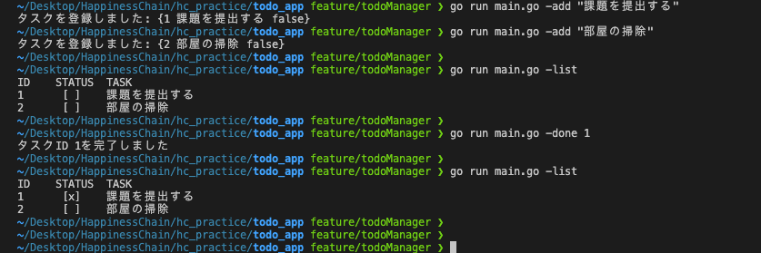

## Todo管理ツール

GoでシンプルなTodo管理CLIを実装しました。  
`TaskManager` 構造体でタスク一覧・ID管理・JSONファイルの読み書きを管理しています。

- `-add` : タスク追加
- `-list` : タスク一覧表示
- `-done` : 指定IDのタスクを完了状態に更新

タスク情報は `tasks.json` に保存し、起動時に読み込んでメモリ上のスライスとして管理します。

